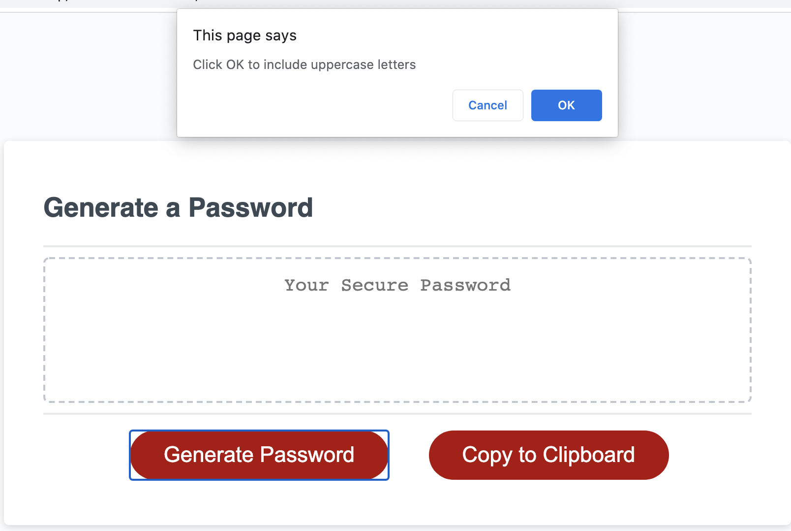
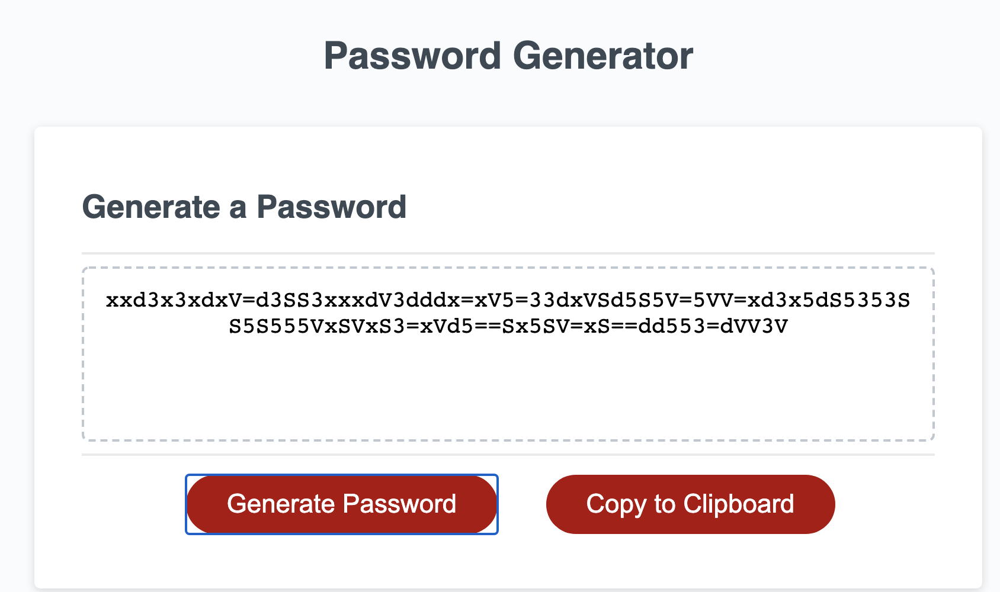
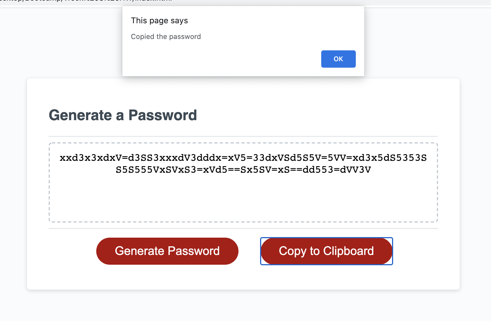
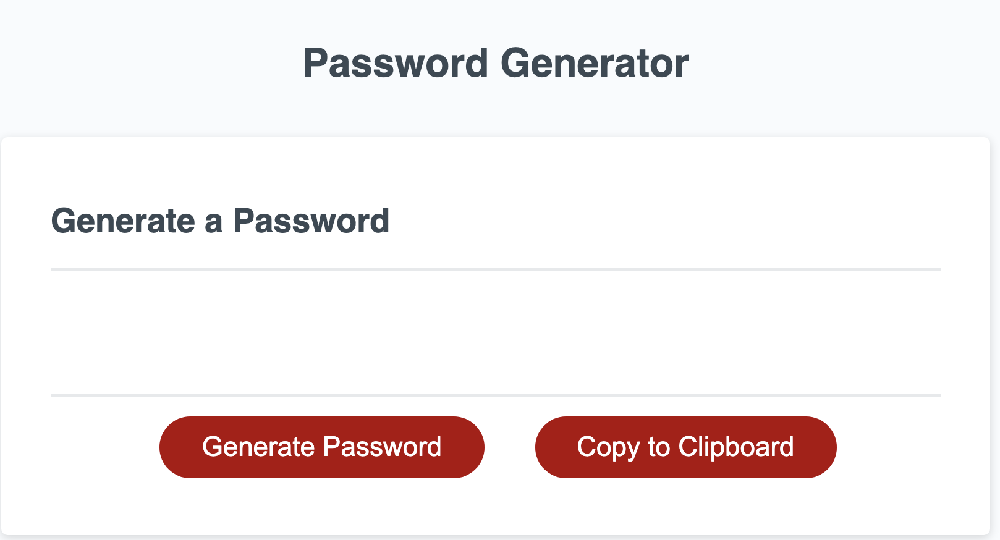

# Random Password Generator

## Description 
The HTML file (linked to the js and css files in the asset folder) launches a random password generator.

## Link to Deployed Application

https://aksco.github.io/passwordgenerator/

## Usage

Click on "Generate Password" and follow the prompts that appear on screen.
(See Screenshots 1 and 2)

If you click "Copy to Clipboard", the screen will resemble Screenshots 3 and 4.

## Things to Note

The "Copy to Clipboard" functionality requires further development.
At this point, you will not be able to "Paste" the copied password anywhere else.

## Credits/Collaboration

The code was built upon the starter code provided by Bryan Wu from Triology Education Services

## Copyright

© 2020 Trilogy Education Services, LLC, a 2U, Inc. brand. Confidential and Proprietary. All Rights Reserved.
